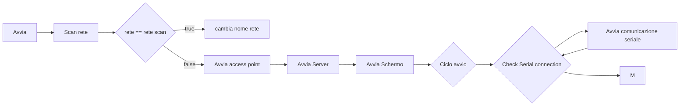
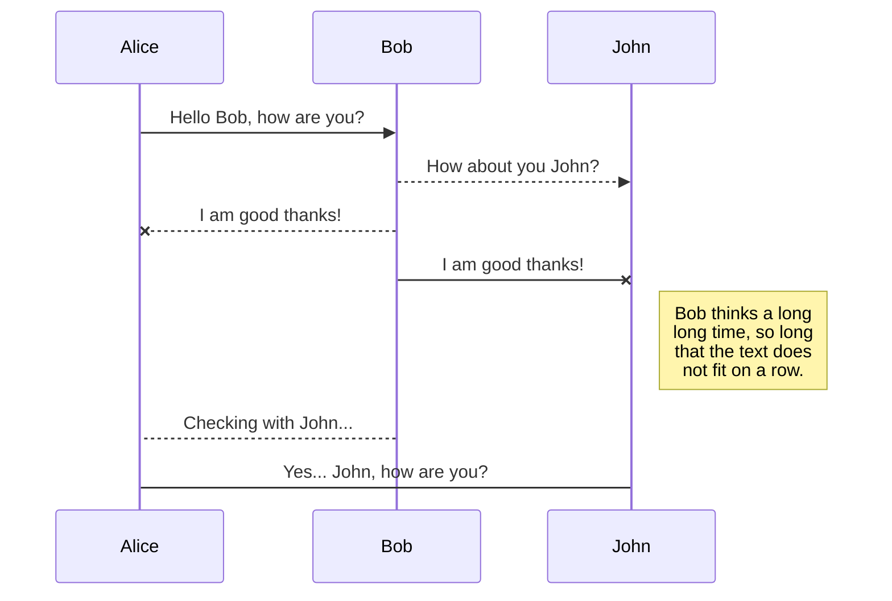
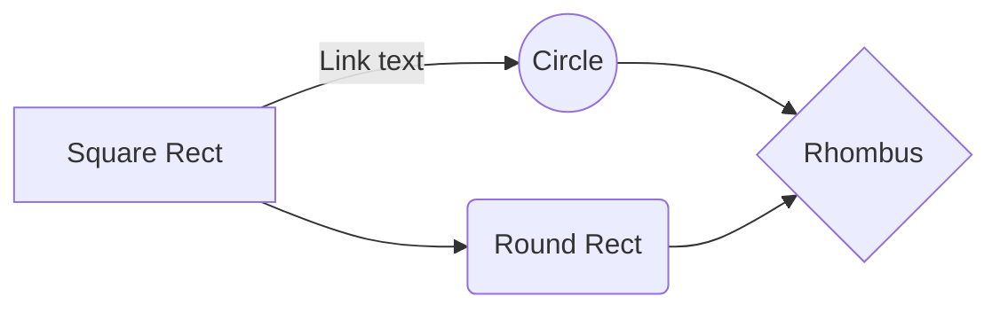

# Cubot

## Cartelle
    - Robot
    	 - firmware
    		 - cubot_0.1v
    	 - applicazioni
    		 - android
    			 - app
    			 - utilities
    		 - ios
    		 - windows
    	 - gcode
    	 - utilities_code
    	 - Freenove_ESP32_S3_WROOM_Board-main

## Componenti

### - Elettronici
| Componente | Quantità | Acquisto |
|--|--|--|
| [Freenove_ESP32_S3_WROOM_Board](https://github.com/Freenove/Freenove_ESP32_S3_WROOM_Board) | 1 | [Aliexpress](https://it.aliexpress.com/item/1005004960637276.html?gps-id=pcStoreLeaderboard&scm=1007.22922.271278.0&scm_id=1007.22922.271278.0&scm-url=1007.22922.271278.0&pvid=cd21d63e-35c4-4836-8b5f-88bc2b6a78b9&_t=gps-id:pcStoreLeaderboard,scm-url:1007.22922.271278.0,pvid:cd21d63e-35c4-4836-8b5f-88bc2b6a78b9,tpp_buckets:668#2846#8107#1934&pdp_ext_f=%7B%22sku_id%22:%2212000031163496708%22,%22sceneId%22:%2212922%22%7D&pdp_npi=3@dis!EUR!13.03!13.03!!!!!@211b5e1d16785553435738710ef8d3!12000031163496708!rec!IT!&spm=a2g0o.store_pc_home.smartLeaderboard_2004236299966.1005004960637276&gatewayAdapt=glo2ita) |
| sg90-analog 9g | 6 | [Waveshare](https://www.waveshare.com/product/robotics/motors-servos/servos/sg90-servo.htm) |
| DS18B20 (sensore di temperatura) | 1 |  |
| MAX4466 (microfono) | 1 |  |
| MAX98357A  (amplificatore) | 1 |  |
| speaker 2W | 1 |  |
| 240×240, General 1.28inch Round LCD Display Module, 65K RGB | 1 | [Waveshare](https://www.waveshare.com/product/displays/lcd-oled/lcd-oled-3/1.28inch-lcd-module.htm) |
| [LC709293F (Modulo Caricabatterie)](https://learn.adafruit.com/adafruit-lc709203f-lipo-lipoly-battery-monitor/overview) | 1 | [Adafruit](https://www.adafruit.com/product/4712) |
| [ TP4056 (Modulo Caricabatterie Versione 2)](https://learn.adafruit.com/adafruit-lc709203f-lipo-lipoly-battery-monitor/overview) | 1 | [Adafruit](https://www.adafruit.com/product/4712) |
| Li-ion 18650 2900 mAh | 1 | [Tuttobatterie](https://www.tuttobatterie.com/batteria-ricaricabile-speciale-li-ion-18650-samsung-inr18650-29e-3-7v-2900-mah.html) |
| cavo carica e comunicazione (incluso con esp32) | 1 | [Aliexpress](https://it.aliexpress.com/item/1005004960637276.html?gps-id=pcStoreLeaderboard&scm=1007.22922.271278.0&scm_id=1007.22922.271278.0&scm-url=1007.22922.271278.0&pvid=cd21d63e-35c4-4836-8b5f-88bc2b6a78b9&_t=gps-id:pcStoreLeaderboard,scm-url:1007.22922.271278.0,pvid:cd21d63e-35c4-4836-8b5f-88bc2b6a78b9,tpp_buckets:668#2846#8107#1934&pdp_ext_f=%7B%22sku_id%22:%2212000031163496708%22,%22sceneId%22:%2212922%22%7D&pdp_npi=3@dis!EUR!13.03!13.03!!!!!@211b5e1d16785553435738710ef8d3!12000031163496708!rec!IT!&spm=a2g0o.store_pc_home.smartLeaderboard_2004236299966.1005004960637276&gatewayAdapt=glo2ita) |

### - Fisici
Tutti i pezzi del robot

## App

### - Android
#### Funzionalità

### - IOS
#### Funzionalità

### - Windows
#### Funzionalità
#### Library

## Code
[CARTELLA CODICE](/_DRIVE/progetti/2023/Robot/firmware/)

Il codice è in **MicroPython** e serve a far funzionare il robot.

### - Library
already installed
math
time
os
sys
json
threading
socket
ssl
urllib
http.client
email
smtplib
imaplib
xmlrpc.client
random
hashlib
hmac
base64
itertools
re
struct
array
collections
queue
multiprocessing
subprocess
Inoltre, l'ESP32 supporta anche altre librerie specifiche per il microcontrollore, tra cui:

esp32
network
machine
uasyncio
ujson
uos
usocket
ustruct
utime
uhashlib
ubinascii
#### For research library micropython
[Site with all library](https://awesome-micropython.com/)

#### Install library with internet
[Tutorial](https://null-byte.wonderhowto.com/how-to/use-upip-load-micropython-libraries-onto-microcontroller-over-wi-fi-0237888/)

#### Used library
- [gc9a01py](https://github.com/russhughes/gc9a01py) Screen
- [dht](nd) Test temperature sensor from library freenove
- [LC709203F](https://github.com/scopelemanuele/Micropython-LC709203F) Test LC709203F
- [servo - pca9685](https://github.com/mcauser/deshipu-micropython-pca9685) Servo
- [qrcode](https://qrcode.tec-it.com/it/Wifi)
### - Firmware

#### Esp32-S3-Wroom-1 Python
**[GENERIC_S3-20220618-v1.19.1.bin](https://micropython.org/download/GENERIC_S3/)**

#### Esp32-S3-Wroom-1 Arduino
##### Setup
- CAMERA_MODEL_ESP32S3_EYE
- Flash size 8MB
- Partition scheme 8M with spiffs
- OPI PSRAM

#### - Logica

C[Avvia seriale] --> D[Avvia schermo] --> E[Avvia Server]

## ESEMPI PER MARKDOWN
## KaTeX

You can render LaTeX mathematical expressions using [KaTeX](https://khan.github.io/KaTeX/):

The *Gamma function* satisfying $\Gamma(n) = (n-1)!\quad\forall n\in\mathbb N$ is via the Euler integral

$$
\Gamma(z) = \int_0^\infty t^{z-1}e^{-t}dt\,.
$$

> You can find more information about **LaTeX** mathematical expressions [here](http://meta.math.stackexchange.com/questions/5020/mathjax-basic-tutorial-and-quick-reference).

## UML diagrams

You can render UML diagrams using [Mermaid](https://mermaidjs.github.io/). For example, this will produce a sequence diagram:

And this will produce a flow chart:

