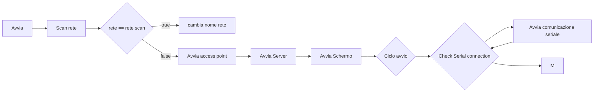
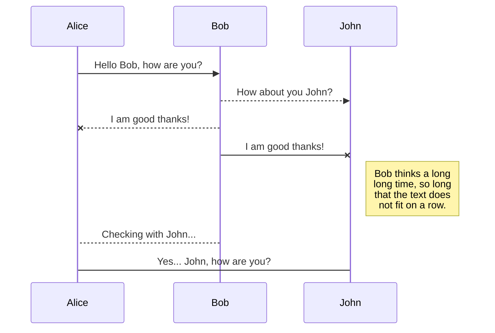
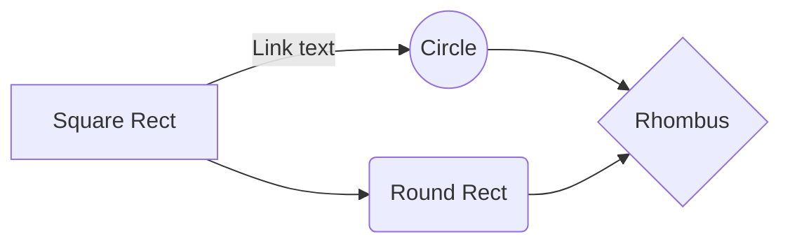

# Cubot

## Cartelle
    - Robot
    	 - firmware
    		 - cubot_0.1v
    	 - applicazioni
    		 - android
    			 - app
    			 - utilities
    		 - ios
    		 - windows
    	 - gcode
    	 - utilities_code
    	 - Freenove_ESP32_S3_WROOM_Board-main

## Componenti

### - Elettronici
| Componente | Quantità | Acquisto |
|--|--|--|
| [Freenove_ESP32_S3_WROOM_Board](https://github.com/Freenove/Freenove_ESP32_S3_WROOM_Board) | 1 | [Aliexpress](https://it.aliexpress.com/item/1005004960637276.html?gps-id=pcStoreLeaderboard&scm=1007.22922.271278.0&scm_id=1007.22922.271278.0&scm-url=1007.22922.271278.0&pvid=cd21d63e-35c4-4836-8b5f-88bc2b6a78b9&_t=gps-id:pcStoreLeaderboard,scm-url:1007.22922.271278.0,pvid:cd21d63e-35c4-4836-8b5f-88bc2b6a78b9,tpp_buckets:668#2846#8107#1934&pdp_ext_f=%7B%22sku_id%22:%2212000031163496708%22,%22sceneId%22:%2212922%22%7D&pdp_npi=3@dis!EUR!13.03!13.03!!!!!@211b5e1d16785553435738710ef8d3!12000031163496708!rec!IT!&spm=a2g0o.store_pc_home.smartLeaderboard_2004236299966.1005004960637276&gatewayAdapt=glo2ita) |
| sg90-analog 9g | 6 | [Waveshare](https://www.waveshare.com/product/robotics/motors-servos/servos/sg90-servo.htm) |
| DHT11 (sensore di temperatura) | 1 |  |
| inmp441 (microfono) | 1 |  |
| MAX98357A  (amplificatore) | 1 |  |
| speaker 2W | 1 |  |
| 240×240, General 1.28inch Round LCD Display Module, 65K RGB | 1 | [Waveshare](https://www.waveshare.com/product/displays/lcd-oled/lcd-oled-3/1.28inch-lcd-module.htm) |
| [ TP4056 (Modulo Caricabatterie)] | 1 | [aliexpress](https://it.aliexpress.com/item/1005005237080994.html?src=google&src=google&albch=shopping&acnt=494-037-6276&slnk=&plac=&mtctp=&albbt=Google_7_shopping&albagn=888888&isSmbAutoCall=false&needSmbHouyi=false&albcp=19215243512&albag=&trgt=&crea=it1005005237080994&netw=x&device=c&albpg=&albpd=it1005005237080994&gad_source=1&gclid=Cj0KCQjwqP2pBhDMARIsAJQ0CzomJahSgcT2h1HFcM23qx6XmopDRa34VUY_UlM-na5dkJ6kSl9_mS4aAuRpEALw_wcB&gclsrc=aw.ds&aff_fcid=8a3572c6e92b41ab9b4ac060aa40f5d2-1698692849410-05852-UneMJZVf&aff_fsk=UneMJZVf&aff_platform=aaf&sk=UneMJZVf&aff_trace_key=8a3572c6e92b41ab9b4ac060aa40f5d2-1698692849410-05852-UneMJZVf&terminal_id=564917b7f57540efb44a014f9c1dcaad&afSmartRedirect=y) |
| Li-ion 18650 2900 mAh | 1 | [Tuttobatterie](https://www.tuttobatterie.com/batteria-ricaricabile-speciale-li-ion-18650-samsung-inr18650-29e-3-7v-2900-mah.html) |
| cavo carica e comunicazione (incluso con esp32) | 1 | [Aliexpress](https://it.aliexpress.com/item/1005004960637276.html?gps-id=pcStoreLeaderboard&scm=1007.22922.271278.0&scm_id=1007.22922.271278.0&scm-url=1007.22922.271278.0&pvid=cd21d63e-35c4-4836-8b5f-88bc2b6a78b9&_t=gps-id:pcStoreLeaderboard,scm-url:1007.22922.271278.0,pvid:cd21d63e-35c4-4836-8b5f-88bc2b6a78b9,tpp_buckets:668#2846#8107#1934&pdp_ext_f=%7B%22sku_id%22:%2212000031163496708%22,%22sceneId%22:%2212922%22%7D&pdp_npi=3@dis!EUR!13.03!13.03!!!!!@211b5e1d16785553435738710ef8d3!12000031163496708!rec!IT!&spm=a2g0o.store_pc_home.smartLeaderboard_2004236299966.1005004960637276&gatewayAdapt=glo2ita) |

### - Fisici
Tutti i pezzi del robot

## App

### - Android
#### Funzionalità

### - IOS
#### Funzionalità

### - Windows
#### Funzionalità
#### Library

## Code
[CARTELLA CODICE](/_DRIVE/progetti/2023/Robot/firmware/)

Il codice è in **C** e serve a far funzionare il robot.
### - Library
https://github.com/Bodmer/TFT_eSPI.git
https://github.com/pablomarquez76/AnalogWrite_ESP32.git
https://github.com/mysensors/MySensorsArduinoExamples/blob/master/libraries/UTFT/Tools/ImageConverter565.exe

### - Firmware
#### Esp32-S3-Wroom-1 Arduino
#### Pins
##### Servo
9
10
11
12
13

##### Screen
37 > TFT_MOSI
36 > TFT_SCLK
35 > TFT_CS
48 > TFT_DC
47 > TFT_RST
21 > TFT_BL

##### Setup
- CAMERA_MODEL_ESP32S3_EYE
- Flash size 8MB
- Partition scheme 8M with spiffs
- OPI PSRAM

#### - Logica

C[Avvia seriale] --> D[Avvia schermo] --> E[Avvia Server]

## ESEMPI PER MARKDOWN
## KaTeX

You can render LaTeX mathematical expressions using [KaTeX](https://khan.github.io/KaTeX/):

The *Gamma function* satisfying $\Gamma(n) = (n-1)!\quad\forall n\in\mathbb N$ is via the Euler integral

$$
\Gamma(z) = \int_0^\infty t^{z-1}e^{-t}dt\,.
$$

> You can find more information about **LaTeX** mathematical expressions [here](http://meta.math.stackexchange.com/questions/5020/mathjax-basic-tutorial-and-quick-reference).

## UML diagrams

You can render UML diagrams using [Mermaid](https://mermaidjs.github.io/). For example, this will produce a sequence diagram:

And this will produce a flow chart:

